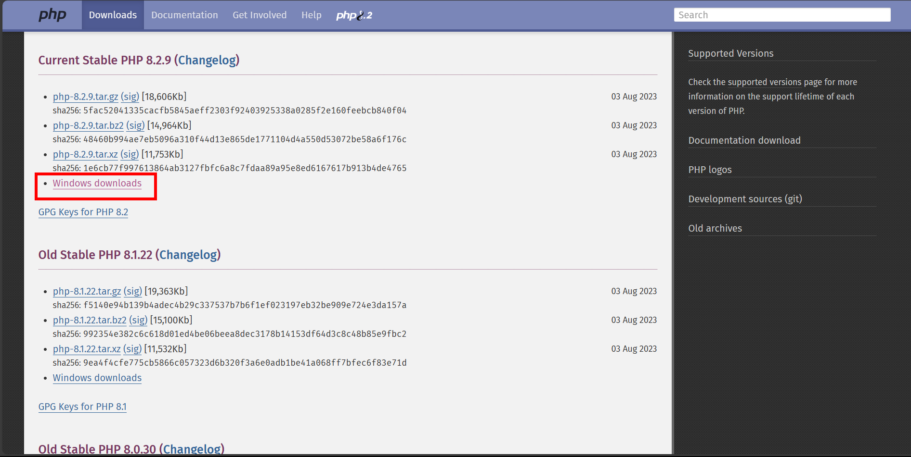
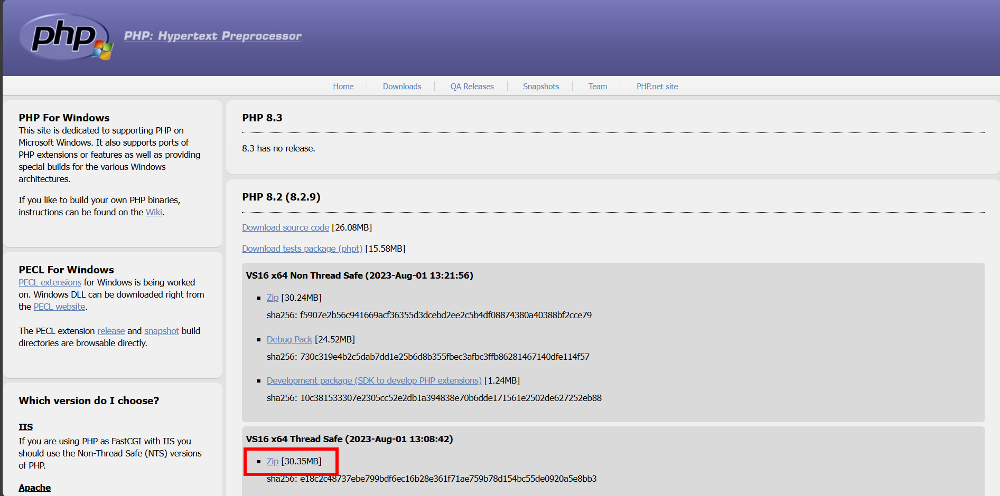
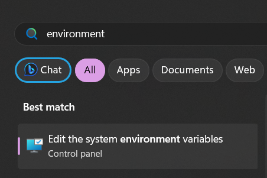
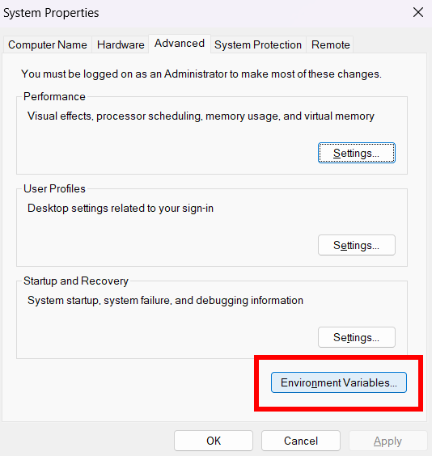
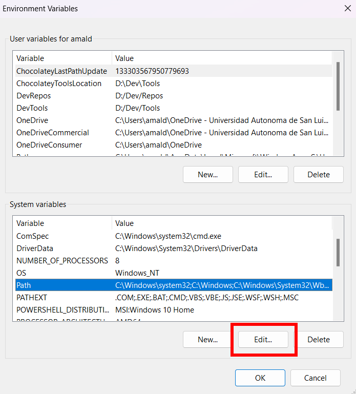
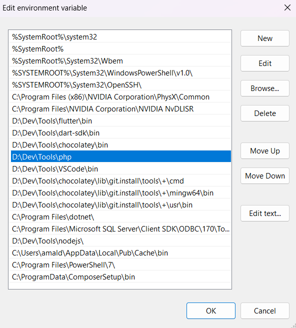
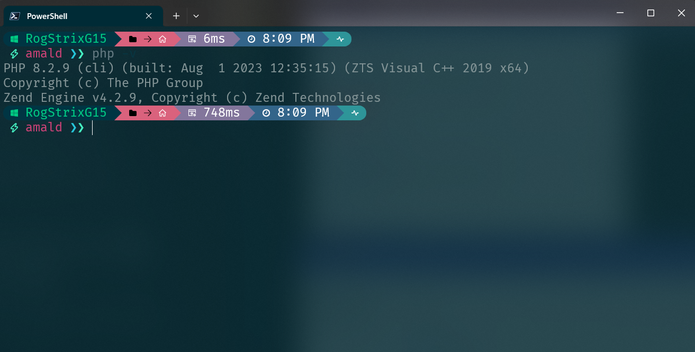

# Agenda Escolar (UASLP)

El propósito de este proyecto es la creación de una **aplicación web dinámica** que asista a la *Secretaría Escolar* de
la *Facultad de Ingeniería* de la *Universidad Autónoma de San Luis Potosí* en la visualización, creación, y
actualización de las distintas actividades y/o eventos que se llevan a cabo durante los periodos escolares 
(*semestres*). Y que además sea atractiva para su consulta y de fácil acceso.

## Colaboradores del proyecto

- Francisco Javier Piña Silva
- Oscar Yasael Varela Palomo
- Angel de Jesús Maldonado Juárez
- Erika Guadalupe Granados Grifaldo
- Manuel Ruiz Salinas

## Documentación

Toda la documentación que implica el análisis y diseño del proyecto se encuentra en el directorio [doc/](./doc),
en este directorio están los siguientes documentos:

- [*SRS (Software Requirements Specifications)*](./doc/SRS.docx): documento que especifica desde la definición del 
  cliente, objetivo, y alcance, hasta describir detalladamente los requerimientos que solicitó el cliente durante las 
  entrevistas.
- [*Documento de modelado y diseño*](./doc/Modelado%20y%20diseño.docx): documento que muestra a un nivel más detallado 
  y específico qué es lo que el sistema va a realizar en términos de funcionalidades, instrucciones, e interacciones 
  con el software, utilizando texto y diagramas de modelado *UML*.
- [*Acta constitutiva*](./doc/Acta%20constitutiva.docx): es la confirmación de que los requerimientos y diseño del
  sistema ha sido autorizado por el cliente.

## Arquitectura y estructuración del proyecto

La arquitectura **Cliente-Servidor** es la que se utiliza en el
proyecto, debido a que se trata de un proyecto web,
se espera que toda la comunidad de la *Facultad de Ingeniería* 
consulte la *Agenda Escolar* acceda mediante peticiones al servidor de
la universidad para acceder a la aplicación.

### Patrón de diseño MVC

Para lograr una escalabilidad mayor del proyecto, para la codificación
del mismo se utiliza el patrón de diseño *MVC 
(Modelo-Vista-Controlador)*. Esto con el fin de que en futuras
versiones del sistema resulte sencillo aplicar modificaciones ya sea a
la interfaz de usuario o a la lógica de almacenado e interacción con
los datos.

### Directorios

Para una mejor organización del proyecto, este está separado en los
directorios [backend/](./backend) y [frontend/](./frontend), donde el
primero contiene todo el código relacionado a la interacción con la
base de datos y, siguiendo la lógica del *MVC*, aquí se encuentran las
clases **Controller** y **Model**. Mientras que el segundo directorio
contiene todo el código relacionado a la interfaz de usuario, es decir,
la **Vista**.

*Para más información acerca de la programación de cada directorio,
en su respectivo directorio se encuentra el archivo `README.md`.*

## Instalación

Para poder ejecutar el proyecto en un servidor local y en modo de
prueba, son necesarios instalar *PHP*, *Composer*, *Node.js*, *npm*, y
contar con cualquier navegador web.

### *PHP*

*PHP* es el lenguaje de programación que se utiliza del lado del servidor
(*backend*) para la interacción con la base de datos y el envío de
respuestas al cliente (*frontend*).

Para instalar *PHP* en **Windows** se pueden descargar los binarios
desde la [pagina oficial de *PHP*](https://www.php.net/downloads.php),
accediendo desde el enlace 
[Windows downloads](https://windows.php.net/download#php-8.2) y
seleccionando la opción *.Zip* de la versión más reciente 
*Thread Safe*:

Una vez descargado y descompreso el archivo `.zip`, se 
debe colocar el directorio en una ruta de fácil acceso,
como `D:\Dev\Tools\php`, y finalmnente para que 
**Windows** pueda ejecutar instrucciones de *PHP* desde la
terminal, se debe agregar la ruta del directorio `php` a la
variable de entorno `PATH`:

Para probar que la instalación de *PHP* fue exitosa, se puede
ejecutar el comando `php -v` en la terminal, y se debe mostrar
la versión de *PHP* instalada:

